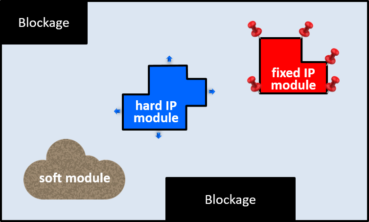

 

# FRAME: Floorplanning with RectilineAr ModulEs

Chip planning is the first task in the physical design of integrated circuits.
During chip planning, the location and shapes of large modules are defined, pins are assigned, 
and the power delivery network is laid out. The quality of the chip, 
in terms of area, wirelength and timing, highly depends on the top-level
early decisions taken during chip planning.

`FRAME` is a framework for floorplanning, which is the chip planning stage
that positions and shapes the modules on the die. Modules can range from 
hard fixed-size blocks to soft free-form IP cores with several million gates
and embedded memories.

Modern floorplanning frameworks must provide features that should enable:

* A high degree of automation with human-in-the-loop interactive features.
* A friendly interface for chip architects to specify preferences and physical constraints.
* Hierarchical planning.
* A diversity of non-rectangular rectilinear shapes for soft modules.
* Arbitrary rectilinear shapes for hard blocks.
* Early global routing between modules.

Automation is achieved by running efficient algorithms on mathematical models
(abstract approximations) of the problem.

`FRAME` envisions _floorplanning_ as a sequence of transformations at different
levels of abstraction. Some of the abstractions for modules can be:

* Mass points
* Circles
* Squares
* Rectangles
* Rectilinear polygons

Similarly, different models can be used to estimate the wirelength of the nets:

* Euclidean distance
* Half-Perimeter Wire Length (HPWL) of the bounding box
* Log-Sum-Exp approximations of the bounding box 

When floorplanning is automated, a pipeline of optimization tasks based on
mathematical models is typically envisioned, using different abstractions,
as shown in the figure below.

`FRAME` is architected to support a variety of features (see figure below).
Rectangular dies may have unusuable regions (blockages). Some blocks may represent hard IP modules that can be moved across the die but cannot be reshaped. Some of these modules may be even nailed down at fixed locations. Finally, soft modules can be placed at any location and adopt different shapes.

`FRAME` allows the shapes of soft modules to be orthogonal polygons.
An interesting class of polygons is the one called
[*Single-Truck Orthogonal Polygons (STROPs)*](doc/STROP.md), which is a subclass of polygons that admits geometries beyond the conventional L-, T-, Z- or U-shapes.

In the future, `FRAME` will also support dies with dedicated regions.
A typical example is an FPGA die with slices dedicated to BRAMs or DSPs, as shown in the figure below.
Modules may use resources from different regions and floorplanning must take into account
where these resources are located on the die.

## The `FRAME` pipeline

_Floorplanning_ is a multi-objective problem that cannot be solved using simple algorithmic techniques.
`FRAME` advocates for a multistep approach moving from coarse abstractions of the modules (e.g., points)
to detailed representations (e.g., orthogonal polygons). At each level, a suitable algorithmic strategy is
used that combines the accuracy of the representation with the optimality of the solution.
`FRAME` exploits mathematical and algorithmic methods to progressively refine the floorplanning information.

A possible set of techniques for the floorplanning flow is next described.
At the beginning, modules can be treated as points or circles. Spectral methods, based on the computation 
of eigenvectors and eigenvalues from the netlist hypergraph, can be used to find good relative positions 
of the modules. Next, force-directed methods can be used to find a good spreading across the die, possibly 
using the eigenvectors as initial solutions. Modules can then be represented as clouds that can adopt 
different shapes to accommodate the required area. Gradient-based non-linear optimization techniques can be 
used to reshape the modules using non-rectilinear free forms. The non-optimality of local minima can be
mitigated by providing a good initial approximation obtained from the previous stage.
Combinatorial optimization techniques (e.g., SAT or pseudo-Boolean optimization) can next be used to find 
rectilinear approximations of the modules (orthogons) on a virtual grid.
A final step may use non-linear optimization to legalize locations and shapes such that
module overlaps are eliminated.

`FRAME` is designed in a modular way such that new stages can be inserted into the pipeline. These new
stages can help smooth the jumps between different levels of abstractions and enable the
interaction with the architect through the definition of physical constraints on the final floorplan.

**Disclaimer**: `FRAME`is a framework in continuous evolution. The contents of this repository shows the current status of the development, with very limited documentation.
The repository will be consolidated as the different tools are updated and completed. 

