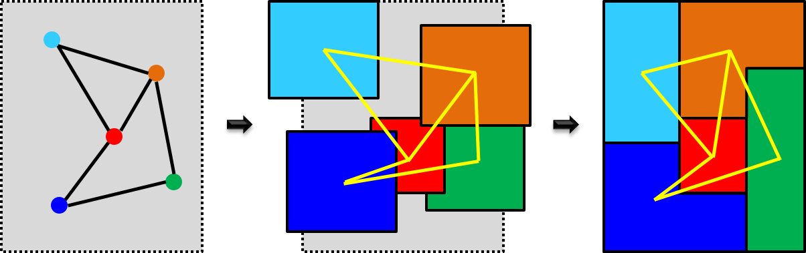
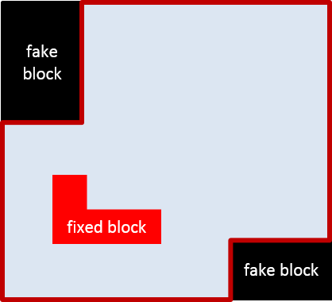
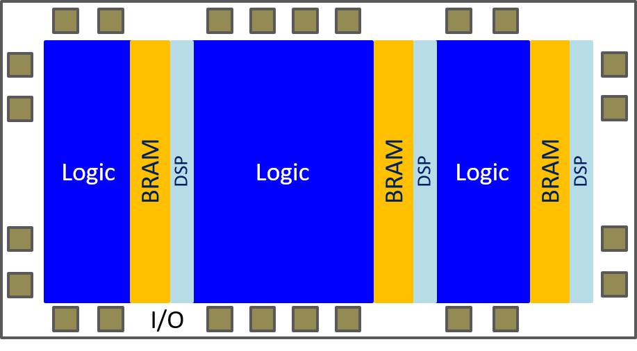

 

# FRAME: Floorplanning with RectilineAr ModulEs

`FRAME` is a framework for chip planning where modules can be implemented as rectilinear
blocks.

If we consider _floorplanning_ as an evolutive process, a floorplan can be represented at 
different levels of abstraction. Depending on the level of detail, a module can be seen 
as a point, a circle, a rectangle or a rectilinear shape. 
When floorplanning is automated, a sequence of optimization tasks
based on mathematical models is typically envisioned, as shown in the figure below.

Modern floorplans require shapes beyond the conventional rectangles, e.g., L-shapes, 
T-shapes or even  C-shapes. Moreover, a close interaction with the designer is often 
required, e.g., by fixing blocks or by defining non-rectangular dies. Using a simple trick,
non-rectangular dies can be represented by including _fake_ blocks that determine the 
blockages inside the rectangular  die, as shown in the following figure.

The die where the system must be floorplanned may contain dedicated regions. 
A typical example is an
FPGA die with slices dedicated to BRAMs or DSPs, as shown in the figure below.

Modules may use resources from different regions and floorplanning must take into account 
where these resources are located on the die.
