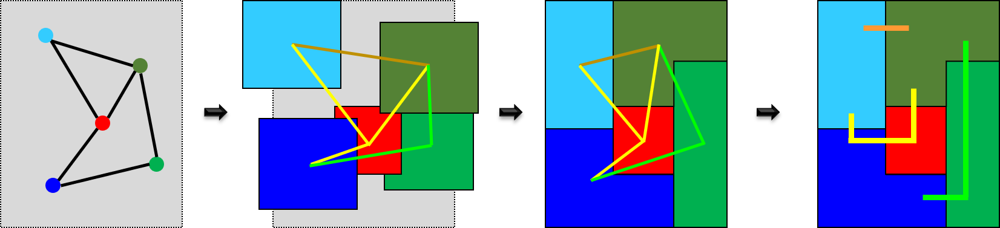

 

# FRAME: Floorplanning with RectilineAr ModulEs

Chip planning is the topmost task in physical design in which the location
and shapes of large modules are defined, pins are assigned, and the power
delivery network is laid out.

`FRAME` is a framework for floorplanning, which is the chip planning stage
that positions and shapes the modules on the die. Modules can range from 
fixed-size blocks to free-form IP cores with several million gates and
embedded memories.

Modern floorplanning frameworks must provide features that should enable:
* A high-degree of automation with a human-in-the-loop approach.
* A friendly interaction with the designer to specify preferences and
physical constraints.
* A diversity of non-rectangular shapes.

Automation is achieved by running efficient algorithms on mathematical models
(abstract approximations) of the problem.

If we consider _floorplanning_ as an evolutive process, a floorplan can be
represented at  different levels of abstraction. Depending on the level
of detail, a module can be seen as a point, a circle, a rectangle or a
rectilinear shape. When floorplanning is automated, a pipeline of optimization 
tasks based on mathematical models is typically envisioned, as shown in the 
figure below.

Modern floorplans require shapes beyond the conventional rectangles, e.g., L-shapes,
T-shapes, U-shapes Z-shapes, etc. Moreover, a close interaction with the designer is often
required, e.g., by fixing blocks or by defining non-rectangular dies. Using a simple trick,
non-rectangular dies can be represented by including _fake_ blocks that determine the
blockages inside the rectangular die, as shown in the following figure.

The die where the system must be floorplanned may contain dedicated regions.
A typical example is an
FPGA die with slices dedicated to BRAMs or DSPs, as shown in the figure below.

Modules may use resources from different regions and floorplanning must take into account
where these resources are located on the die.

## The `FRAME` pipeline

TBD
