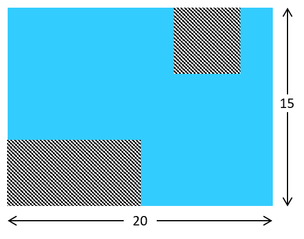
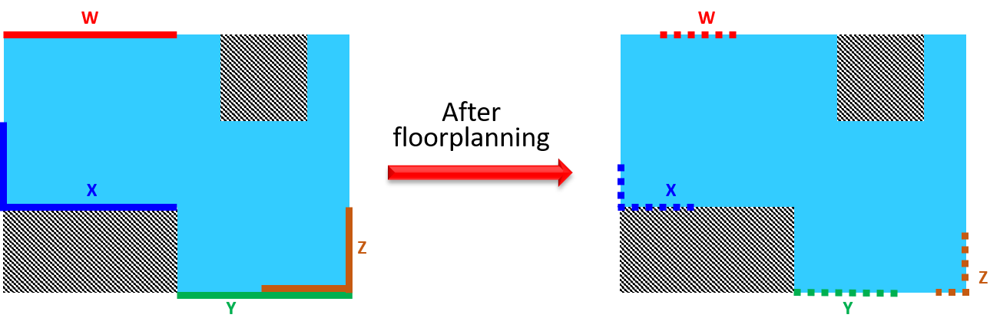

# Die Exchange Format (DIEF)
**Author:** [Jordi Cortadella](https://www.cs.upc.edu/~jordicf)

**Date:** August 21, 2025

---

This document describes a [`YAML`](https://en.wikipedia.org/wiki/YAML)-based exchange format, `DIEF`,
to describe a regionalized die. A die is an area-connected rectilinear polygon in which the modules
of a netlist can be floorplanned.

A conventional die can be a simple rectangle. In some cases it may be interesting
to specify certain dedicated regions for a specific set of resources, forbidden regions
of I/O pins.

The die can be simply the description of a rectangle (width and height)
or a set of non-overlapping rectangles associated to regions, where every region is identified by some type of resource.
This is the classical example of FPGA slices associated to BRAMs or DSPs, as shown in the
figure.

Here is an example of a die with two dedicated regions. The only mandatory attributes are `width` and `height`. The regions not associated to any specific resource are called *ground* regions.
Only the non-ground rectangles are to be specified. Each rectangle is described as a list of five elements:
`[x, y, width, height, region]`, where `x` and `y` are the coordinates of the center.

~~~yaml
# Width and height of the die (mandatory attributes)
width: 19
height: 20
# Non-ground rectangles: [x, y, width, height, region]
rectangles: [
    [6, 10, 2, 20, 'BRAM'],
    [13, 10, 2, 20, 'DSP']
]
~~~

## Non-rectangular dies

For hierarchical floorplanning, the die may not represent the entire chip but
a subchip (possibly non-rectangular) in which a subset of modules must be
floorplanned, as shown in the figure below.

Non-rectangular dies can be specified with a set of rectangles that represent
forbidden regions (blockages). Blockages can be specified as rectangles of a 
particular case of regions (with label `#`).
The previous example has two blockages that can be specified as follows:

~~~yaml
width: 20
height: 15

# Blockages: [x, y, width, height, #]
rectangles: [
    [5, 2.5, 10, 5, '#'],  # lower-left blockage
    [15, 12.5, 5, 5, '#']  # top-right blockage
]
~~~

## Segments for I/O pins

`DIEF` also allows a section where the segments dedicated to I/O pins
are described. I/O pins are treated as *arrays of pins* and are considered as
modules of the netlist. They can be located in segments of the die.
In the same way as conventional modules have an area, I/O pins have a length
(specified in the netlist).

A I/O segment is a zero-area rectangle in which either width or height is
zero. Vertical (horizontal) segments have zero width (height).

The I/O segments specify regions where the I/O pins of a certain module can
be located. The floorplanner should decide the best location for the
IO pins within the assigned segments, also taking care that they do not overlap
with other I/O pins. The floorplanner must guarantee that the length of
the I/O pins is accomodated in the corresponding segments, possibly using
more than one segment.

Let us consider the previous non-rectangular die with four I/O pins
(modules of the netlist): `W`, `X`, `Y` and `Z`.
The left figure shows the assigned segments for each I/O pin. In this case,
the segments for `Y`and `Z` overlap, indicating that these segments can
either accept pins from `Y`or `Z`. The figure at the right shows a possible 
I/O pin assignment after floorplanning.

~~~yaml
width: 20
height: 15

rectangles: [
    [5, 2.5, 10, 5, '#'],
    [15, 12.5, 5, 5, '#']
]

io_segments: {
    'W': [5, 15, 10, 0], # horizontal segment for W
    'X': [[0, 7.5, 0, 5], [5, 5, 10, 0]], # vertical and horizontal segments for X
    'Y': [15, 0, 10, 0], # horizontal segment for Y
    'Z': [[17.5, 0, 5, 0], [20, 2.5, 0, 5]] # horizontal and vertical segments for Z
}
~~~

