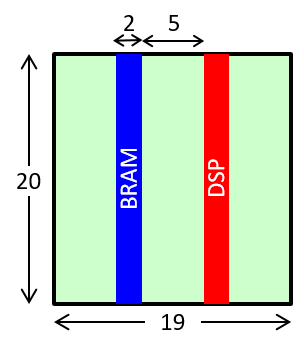

# Die Exchange Format (DIEF)
**Author:** [Jordi Cortadella](https://www.cs.upc.edu/~jordicf)

**Date:** July 2nd, 2022

---

This document describes a [`YAML`](https://en.wikipedia.org/wiki/YAML)-based exchange format, `DIEF`,
to describe a regionalized die. The die can be simply the description of a rectangle (width and height)
or a set of non-overlapping rectangles associated to regions, where every region is identified by some type
of resource. This is the classical example of FPGA slices associated to BRAMs or DSPs, as shown in the
figure.

<figure>

<figcaption style="text-align:center"><b>FPGA die</b></figcaption>
</figure>

Here is an example of a die with two dedicated regions. The only mandatory attributes are `width` and `height`.
Only the non-ground rectangles are to be specified. Each rectangle is described as a list of five elements:
`[x, y, width, height, region]`, where `x` and `y` are the coordinates of the center.

<figure>

<figcaption style="text-align:center"><b>Die specified with two non-ground regions</b></figcaption>
</figure>

~~~yaml

# Width and height of the die (mandatory attributes)
width: 19,
height: 20,
# Non-ground rectangles: [x, y, width, height, region]
rectangles: [
    [6, 10, 2, 20, 'BRAM'],
    [13, 10, 2, 20, 'DSP']
]
~~~
