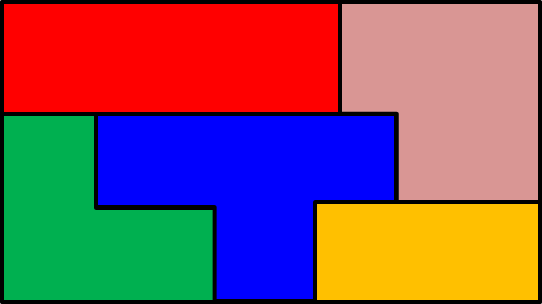
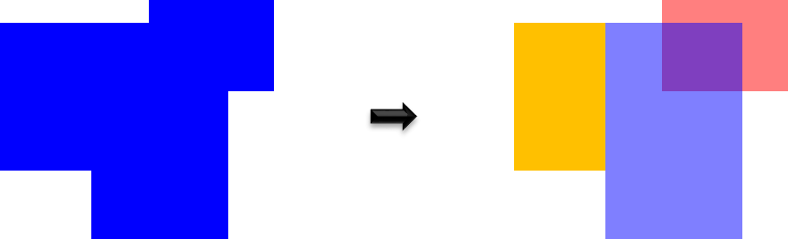
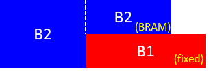

# Floorplan Exchange Format (FPEF)
**Author:** [Jordi Cortadella](https://www.cs.upc.edu/~jordicf)

**Date:** July 2nd, 2022

---

This document describes a [`YAML`](https://en.wikipedia.org/wiki/YAML)-based exchange format,
`FPEF`, to describe rectilinear floorplans. A rectilinear floorplan consists of modules
with rectilinear shapes, aligned with the _x_ and _y_ axes, such as the one shown in the figure.

A floorplan can be represented at different levels of abstraction. Depending on the level of
detail, a module can be seen as a point, a circle,  a rectangle or a rectilinear shape.
When floorplanning is automated, a sequence of optimization tasks
based on mathematical models is typically envisioned. `FPEF` can host different levels of 
abstraction for interchanging floorplaning information between different steps of the
automation process, as shown in the figure below.

## FPEF top view

Using `YAML`'s nomenclature, a floorplan is a mapping with two mandatory keys:
`Modules` and `Nets`. 
Mappings and sequences admit different syntax forms in YAML. In the examples shown in 
this document, only one of these forms is used but the other forms are also accepted.
In mappings, the order of the keys is irrelevant. 

The description of a floorplan has a structure like the one shown in the following example:

~~~yaml
Modules: {
  CPU: {
    # more details later
  },

  L1-Cache: {
    # ...
  }

  # more modules ...
}

Nets: [ # A sequence of hyperedges that represent the connectivity of the modules
  # hyperedges ...
]
~~~

## Modules

A module is identified by a name, e.g. `CPU`, and a set of attributes.
Here is the list of possible attributes:

* `area`: defines the area of the module. Usually it is represented as a number, e.g., `area: 150`. However,
          a regionalized area can also be specified with a mapping,
          e.g., `area: {logic: 30, BRAM: 50, DSP: 15}`.
* `center`: a list of two numbers (x and y coordinates). Example: `center: [2.5, 8]`.
* `aspect_ratio`: it represents an interval of values $[x,y]$, with $x\leq 1 \leq y$, acceptable for the ratio $width/height$. For example, the interval `[0.25,3]` represents the constraint $0.25 \leq w/h \leq 3$. This constraint makes sense for rectangular modules. For non-rectangular modules, it is ign ored (maybe a new interpretation will be given in the future).
* `hard`: indicates whether the module must have a hard (unmutable) shape. Example: `hard: true`. The default value is `false` (soft module).
* `fixed`: indicates whether the module must be in a fixed location. Example: `fixed: true`. The default value is `false`. A fixed module is assumed to be `hard`.
* `flip`: indicates whether the module can be flipped horizontally or vertically. Example: `flip: true``. The default value is `false`. Only non-fixed hard modules can be flipped.
* `rectangles`: a list of rectangles that determine the floorplan of the module. See below.

Here is an example with some attributes:
~~~yaml
  M1: {
    area: 80,
    center: [20, 15], # Center in (x,y)=(20,15)
    aspect_ratio: [0.5, 3] # 0.5 <= w/h <= 3
  },

  M2: { # Module with one fixed rectangle
    rectangles: [60, 75, 10, 12], # Center at (60, 75), width: 10, height:12
    fixed: true
  },

  M3: { # L-shaped module with two rectangles
    rectangles: [[25, 45, 30, 50], [50, 30, 20, 20]]
  }
~~~

#### Module geometry

A rectilinear module can be represented by a set of rectangles, as shown in the figure.

Each rectangle is specified as a 4- or 5-element list, `[x,y,w,h,r]`, where `x` and `y` are the
coordinates of the center, and `w` and `h` are the width and the height.
The 5th element (`r`, optional) is the name of the die region the rectangle must be associated to.
If `r` is not specified, the rectangle is associated to `Ground` (default region).

The attribute `rectangles` can be either specified just one rectangle (a list) or a set of rectangles
(a list of lists).

Here we can see an example with two moduless, each one with a different type of specification.

~~~yaml
  M1: {
    rectangles: [17, 2, 14, 4], # Just one rectangle associated to Ground (red in the figure)
    fixed: true # The module is fixed (the rectangle cannot be moved)
  },

  M2: {
    rectangles: [ # a module represented by two rectangles (blue in the figure)
      [5, 4, 10, 8],         # associated to Ground (default)
      [15, 6, 10, 4, 'BRAM'] # associated to BRAM
    ]
  }
~~~

Since `FPEF` can be used to represent intermediate 
steps of a floorplanning process, the description of a module does not need to be legal, e.g., 
rectangles may overlap or fall outside the bounding box of the floorplan. The rectangles must be 
interpreted as _preferred_ regions where a module would like to be located and the information can be 
used to define the initial point of a mathematical model. At the end of a complete 
floorplanning process, a legal configuration might be required. The constraints for legalization may 
be different depending on the context.

## I/O pins

`FPEF` specifies I/O pins as modules with zero area. The attribute `io_pin` must be set to `true`.
An I/O pin represents an array of pins with a certain *length*. You may interpret the I/O pin length as 
$$\textrm{length} = \textrm{\#pins} \times \textrm{pin pitch}$$

For I/O pins, the `area` attribute is not admissible. Instead, the `length` attribute is used. The location of the I/O pins is represented as zero-area rectangles in which one of the dimensions (width or height) is zero. A pin with width=height=0 (a point) can also be specified.

Here is an example of modules specified I/O pins:

~~~yaml
Modules: {

  # Some modules
  ...
  Addr: { # An I/o pin without any specific location
    io_pin: true,
    length: 30
  },

  Read_Data: { # A hard (movable) vertical array of pins with height=30
    io_pin: true,
    hard: true,
    rectangles: [0, 250, 0, 30]
  },

  Write_Data: {
    # An L-shaped I/O pin array with one vertical segment (height=80)
    # and one horizontal segment (width=40)
    io_pin: true,
    fixed: true,
    rectangles: [[0, 40, 0, 80], [20, 0, 40, 0]]
  }
  ...
}
~~~

## Nets

Nets are represented as weighted sets of modules. The weight can be interpreted as the thickness
(number of wires) of the net. Here is an example with more details on how nets are specified:
~~~yaml
Modules: {
  # ...
}

Nets: [ # A sequence of hyperedges that represent the connectivity of the modules
  [M1, M2],        # An edge connecting B1 and B2 with weight=1 (default)
  [M2, M3, M4, 5], # A hyperedge connecting three moduless with weight=5
  # more hyperedges ...
]
~~~

If the last element of a hyperedge is a number, it is interpreted as the weight of the
hyperedge. If the weight is not specified, the default value is 1.