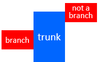
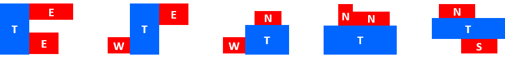

# Orthogonal polygons

`FRAME` can deal with rectilinear modules that are represented by
[Rectilinear Polygons](https://en.wikipedia.org/wiki/Rectilinear_polygon), 
also called Orthogonal Polygons or *Orthogons*.

We are interested in *simple* orthogons, i.e., orthogons without holes. This is a simple orthogon:

An interesting property of orthogons is that they can be partitioned into a set of disjoint rectangles.
We are interested in a particular subclass of orthogons that we call *Single-Trunk Orthogons* (STOG).

## STOG

An orthogon is an STOG if it can be decomposed into a set of disjoint rectangles such that one of them is
called the *trunk* and the others are called *branches*, with the following property:

> Each branch is adjacent to the trunk and fully shares one of its edges with the trunk.

The following picture shows an orthogon that is not a STOG. Assuming that the blue rectangle is the trunk, two
of the other rectangles (left and right) are branches of the trunk, since they fully share one of the edges
with the trunk. However, the bottom rectangle is not a branch, since the common edge is not fully shared
with the trunk.

### $k$-STOG

A $k$-STOG is a STOG with one trunk and $k$ branches. Orthogonal rectangles are $0$-STOGs since they only
have one trunk (the same rectangle) and 0 branches, as shown in this picture:

$1$-STOGs include all the L- and T-shaped orthogons, as shown in this picture:

$2$-STOG offer a rich variety of orthogons, as shown here:

In case you have curiosity of knowing the associated partition of rectangles, the following picture
shows the trunks (T) and branches of each case. The NSEW labels indicate the trunk edge adjacent to each branch.

### Why STOGs?

`FRAME` is based on non-convex optimization models, which typically use gradient-descent algorithms
for finding local minima. It is convenient that the constraints of these models can be represented
by differentiable functions. 

