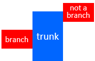

# Orthogonal polygons
**Author:** [Jordi Cortadella](https://www.cs.upc.edu/~jordicf)

**Date:** August 25th, 2022

---

`FRAME` can deal with rectilinear modules that are represented by
[Rectilinear Polygons](https://en.wikipedia.org/wiki/Rectilinear_polygon), 
also called Orthogonal Polygons.

We are interested in *simple* polygons, i.e., polygons without holes. This is a simple polygon:

An interesting property of orthogonal polygons is that they can be partitioned into a set of disjoint rectangles.
We are interested in a particular subclass of orthogons that we call *Single-TRunk Orthogonal Polygons* (STROP).
Another possible nomenclature for the same acronym is *Star Orthogonal Polygons*.

## STROP

A STROP is an orthogonal polygon that can be decomposed into a set of disjoint rectangles with the following property:
* One rectangle is called the trunk and the others are called the branches
* Each branch is adjacent to the trunk and fully shares one of its edges with the trunk

The following picture shows an orthogonal polygon that is not a STROP. Assuming that the blue rectangle is the trunk, two
of the other rectangles (left and right) are branches of the trunk, since they fully share one of the edges
with the trunk. However, the bottom rectangle is not a branch, since the common edge is not fully shared
with the trunk.

### *k*-STROPs

A *k*-STROP is a STROP with one trunk and *k* branches. Orthogonal rectangles are *0*-STROPs since they only
have one trunk and *0* branches, as shown in this picture:

*1*-STROPs include all the L- and T-shaped orthogonal polygons. Here are two examples:

*2*-STROPs offer a rich variety of orthogonal polygons, as shown here:

In case you have curiosity of knowing the associated partition of rectangles, the following picture
shows the trunks (*T*) and branches of each case. The NSEW labels indicate the trunk edge adjacent to each branch.

### The structure of a STROP

The structure of a STROP is characterized by the relative location of its branches, e.g., *0*-STROPs can only have one
structure (orthogonal rectangles), *1*-STROPs can have 4 different structures depending on the location of the branch
(*N*, *S*, *E*, *W*), *2*-STROPs can have 10 different structures (*NN*, *NS*, *NE*, *NW*, *SS*, *SE*, ...). In general,
the number of possible structures of a *k*-STROP is (subsets with repetitions):

$$\binom{k+3}{k}$$

### STROP decomposition

The decomposition of a STROP into trunk/branch rectangles is not unique, as
it can be shown in the figure.

We say that a STROP decomposition is maximal if the trunk cannot be extended
without exceeding the boundaries of the polygon. In the previous example, the
first two decompositions are maximal. The third decomposition is not maximal
as the trunk can still be extended to the east side.

### Why STROPs?

Some of the `FRAME` stages are based on non-convex optimization models, which typically use gradient-descent algorithms
for finding local minima. It is convenient that the constraints used to characterize the structure of a STROP
can be modeled by differentiable functions.

#### Example

Let us assume that a rectangle is represented by the coordinates of its center *(x,y)*, width (*w*) and height
(*h*). Let us consider a STROP with a trunk (*T*) and an *East*-branch (*B*). 

The relative position of the branch
with regard to the trunk can be modeled with three linear constraints (one equality and two inequalities), as follows:

$$
\begin{eqnarray*}
x_B & = & x_T + \frac{w_T + w_B}{2} \\
y_B & \leq & y_T + \frac{h_T-h_B}{2} \\ 
y_B & \geq &  y_T + \frac{h_B-h_T}{2}
\end{eqnarray*}
$$

In case two branches share the same edge, a simple linear constraint may be used to avoid their overlap by
assuming an ordering on the edge, e.g.,

$$y_{B_1}-y_{B_2} \geq \frac{h_{B_2}+h_{B_1}}{2}$$

**Note:** the fact that STROPs can be modeled with linear constraints does not mean that the complete model is linear.
Unfortunately, some other constraints of the same model may not be linear. This is the case of the constraints
that guarantee that rectangles do not overlap.
