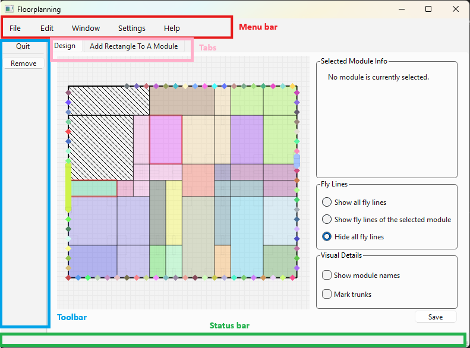
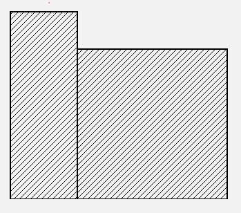

# Floorplanning designer

This tool offers a graphical user interface (GUI) for the design of chip floorplans, allowing users to visualize and edit the design.

## The Main Window of the application
At the top of the application there is a **menu bar** with some menus (*File*, *Edit*, *Window*, *Settings*, and *Help*). For now, only the *File* menu is implemented, the others don't do any action.

On the left side of the window, there is a **toolbar** (a panel with quick access buttons). Currently, it contains only two buttons:

- `Quit`: used to exit the application
- `Remove`: used to remove items from the design

At the bottom of the window, there is a **status bar**. This is a small line where some information is displayed when you hover over some of the toolbar or menu buttons.

Finally, at the center of the window, there are the two **tabs** that contain the main widgets:
- First tab: `Design`
- Second: tab: `Add Rectangle To A Module`

The following picture shows he layout of the main window:

## First tab: Design
This is the most important tab. Here you can edit your floorplan. It is the main workspace for modifying the design.

On the left side, there is a big scene showing the floorplan. In this section, we describe all the items that can be found inside this scene: the die and blockages, modules, I/O Pins, and Fly lines.

On the right side, there are three different boxes:
| Box                    | Description                                                     |
| -----------------------| --------------------------------------------------------------- |
| `Selected Module Info` | Provides details of the selected module, including name, attribute, and connections.|
| `Fly Lines`            | Manages how fly lines are displayed in the scene.|
| `Visual Details`       | Controls the display of trunks and module names.|

### Die and Blockages
A file with the dimensions of the die must be loaded. If there are blockages, they must also be specified in this file. Everything related to this is specified in the `DIEF` documentation.

Blockages are used to define a non-rectangular die. They are represented as rectangles with a specific pattern: white background with diagonal black lines.

### Modules
A module is a set of rectangles that represent a part of a chip. Each module always has a **trunk**, which is the main rectangle. The other rectangles are **branches**, and they must be adjacent to the trunk. 

A module can be just the trunk (a single rectangle), but can also adopt non-rectangular shapes, for example an L-shaped module.

#### Grouping
To be able to reorganize or resize the rectangles of a module, you must first ungroup it. This can be done by unchecking the *group* checkbox that you can find in the `Selected Module Info` box.

Once ungrouped, you can move the rectangles around and resize them (if they are soft). There is also an option in the same box that allows you to mantain the area when resizing.

Finally, if you click on another module or check de *group* checkbox again, the module will regroup. If branches are not adjacent to the trunk they will be moved so that they touch it. After all branches are placed, if any two overlap, one of the two branches' rectangle is cut to remove the overlapping part.

### I/O Pins
They must always be placed at the borders of the die or at the borders of the blockages.

...

### Fly Lines
Fly lines connect modules and terminals.
If two modules are connected, there is a fly line between them. A fly line can be just a simple line, or a hyperedge that connects more than two modules or pins.

The width of each fly line depends on the number of wires connecting the modules or pins:
- The connection with most wires has the widest line
- The connection with fewer wires has the thinnest line
- All other connections are scaled between this widths

The visibility of fly lines can be managed with the `Fly Lines` box. It allows you to show: all fly lines, just those connected to the selected module/pin, or hide them completely.

## Second tab: Add Rectangle To A Module
This tab allows you to add a rectangle to one of the existing modules from the first tab. The scene here is the same as in first tab, but it only shows the modules and blockages. All modules are gray, except for the one you select, which keeps its original color. You cannot move modules in this tab.

There is a dropdown menu to choose the module you want to add the rectangle to. After selecting a module, you must enter the dimensions of the new rectangle and click the `Add` button. This new rectangles will appear in the top-left coner of the scene, and you will be able to place it anywhere (even if the module was fixed).

Once it is placed, you must click the `Join` button, which groups the module again. Finally, you can apply the new changes to the main tab with the `Add to Design` button.