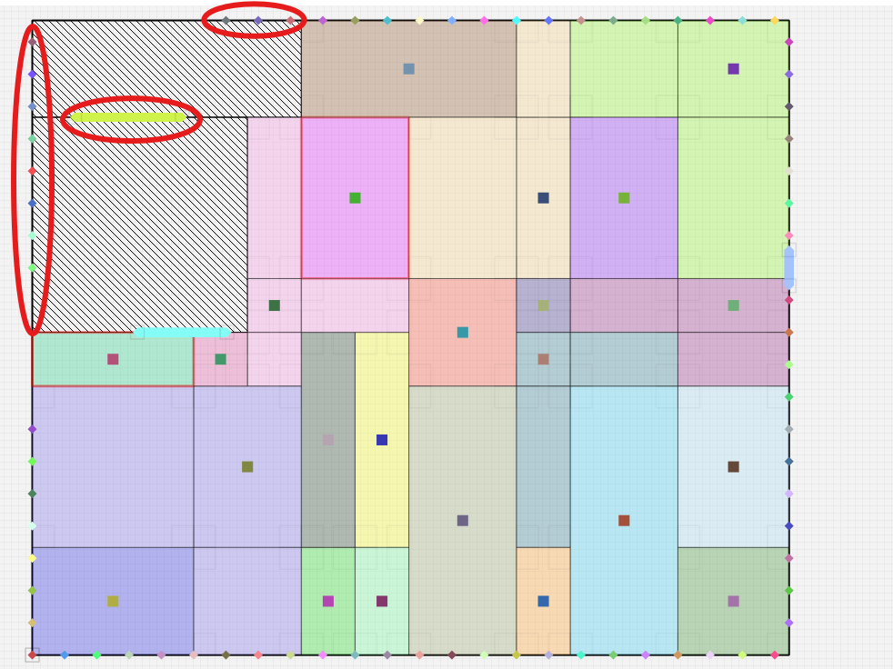

# Floorplanning designer

This tool offers a graphical user interface (GUI) for the design of chip floorplans, allowing users to visualize and edit the design.

## The Main Window of the application
At the top of the application there is a **menu bar** with some menus (*File*, *Edit*, *Window*, *Settings*, and *Help*). For now, only the *File* menu is implemented, the others don't do any action.

If you click on it. A menu will drop down with two options: "Open Design" and "Quit". *Quit* exits the application. *Open Design* opens the file browser so you can first select the Die file and then the Netlist file. Once both files are loaded, you will be able to visualize the design.

On the left side of the window, there is a **toolbar** (a panel with quick access buttons). Currently, it contains only two buttons:

- `Quit`: used to exit the application
- `Remove`: used to remove items from the design

At the bottom of the window, there is a **status bar**. This is a small line where some information is displayed when you hover over some of the toolbar or menu buttons.

Finally, at the center of the window, there are the two **tabs** that contain the main widgets:
- First tab: `Design`
- Second: tab: `Add Rectangle To A Module`

The following picture shows he layout of the main window:

## First tab: Design
This is the most important tab. Here you can edit your floorplan. It is the main workspace for modifying the design.

On the left side, there is a big scene showing the floorplan. In this section, we describe all the items that can be found inside this scene: the die and blockages, modules, I/O Pins, and Fly lines.

On the right side, there are three different boxes:
| Box                    | Description                                                     |
| -----------------------| --------------------------------------------------------------- |
| `Selected Module Info` | Provides details of the selected module, including name, attribute, and connections.|
| `Fly Lines`            | Manages how fly lines are displayed in the scene.|
| `Visual Details`       | Controls the display of trunks and module names.|

### Die and Blockages
A file with the dimensions of the die must be loaded. If there are blockages, they must also be specified in this file. Everything related to this is specified in the `DIEF` documentation.

Blockages are used to define a non-rectangular die. They are represented as rectangles with a specific pattern: white background with diagonal black lines.

### Modules
A module is a set of rectangles that represent a part of a chip. Each module always has a **trunk**, which is the main rectangle. The other rectangles are **branches**, and they must be adjacent to the trunk. 

A module can be just the trunk (a single rectangle), but can also adopt non-rectangular shapes, for example an L-shaped module.

> [!WARNING]
> The modules cannot be removed from the design. 
> Trunks cannot be deleted -> you can only remove branches.

#### Grouping
To be able to reorganize or resize the rectangles of a module, you must first ungroup it. This can be done by unchecking the *group* checkbox that you can find in the `Selected Module Info` box.

Once ungrouped, you can move the rectangles around and resize them (if they are soft). There is also an option in the same box that allows you to mantain the area when resizing.

Finally, if you click on another module or check de *group* checkbox again, the module will regroup. If branches are not adjacent to the trunk they will be moved so that they touch it. After all branches are placed, if any two overlap, one of the two branches' rectangle is cut to remove the overlapping part.

### I/O Pins
They must always be placed at the borders of the die or at the borders of the blockages, but only on the actual outer boundariesof the design. For example, if the die has an L-shape created by a blockage in the upper-left corner, no pins can be placed inside that blocked area, only along the real edges of the die.

In the image below, the pins that are in **illegal locations** are highlighted with red circles:

Pins are treated similarly to modules, meaning that all the same operations apply: you can **group/ungroup**, **move** and **resize** them (depending on the attribute). However, pins are composed of one or more segments, up to a maximum of three.

#### Orientation
If you have a horizontal pin and want to change it to veritcal, you must:
1. **Ungroup** the pin
2. Select the segment (rectangle) you want to rotate 90º
3. In the `Selected Module Info` box, a new button **"Change Orientation** will appear. Clicking it will rotate the selected segment.

For changing from vertical to horizontal, you must follow the same steps.

#### Adjustment for Three-Segment Pins
For pins made up of **three segments**, you may need to adjust their alignment with nearby blockages or die edges.
Once the pin is positioned in a legal location, click the **"Adjust Segments"** button (available in the `Selected Module Info` box only for three-segment pins). This will automatically adjust the internal segments so that they connect properly and align with the boundaries.

### Fly Lines
Fly lines connect modules and terminals.
If two modules are connected, there is a fly line between them. A fly line can be just a simple line, or a hyperedge that connects more than two modules or pins.

The width of each fly line depends on the number of wires connecting the modules or pins:
- The connection with most wires has the widest line
- The connection with fewer wires has the thinnest line
- All other connections are scaled between this widths

The visibility of fly lines can be managed with the `Fly Lines` box. It allows you to show: all fly lines, just those connected to the selected module/pin, or hide them completely.

### Saving the design
At the bottom-right corner of this tab, there is a `Save` button.
When you click it, the application checks for potential issues and displays warnings if needed:

* A list of all **modules placed outside the scene boundaries or colliding with blockages**
* A list of all **pins placed in invalid locations** (for example, not on the actual border of the die).

You can still proceed with saving even if these warnings appear, but they are shown to make you aware of possible placement errors before finalizing the design.

## Second tab: Add Rectangle To A Module
This tab allows you to add a rectangle to one of the existing **modules or I/O pins** from the first tab. The scene here is the same as in first tab, but it only shows the modules and blockages. All modules are gray, except for the one you select, which keeps its original color. You cannot move modules in this tab.

There is a dropdown menu to choose the module you want to add the rectangle to. After selecting a module, you must enter the dimensions of the new rectangle and click the `Add` button. This new rectangles will appear in the top-left coner of the scene, and you will be able to place it anywhere (even if the module was fixed).

Once it is placed, you must click the `Join` button, which groups the module again. Finally, you can apply the new changes to the main tab with the `Add to Design` button.