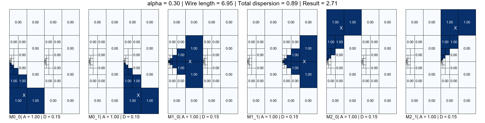
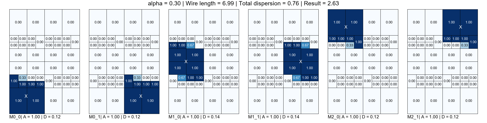
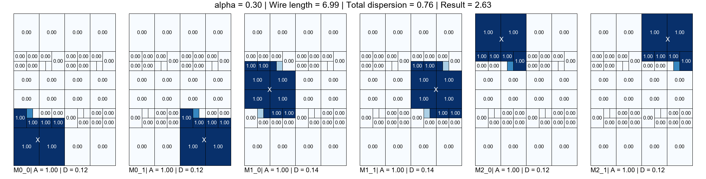
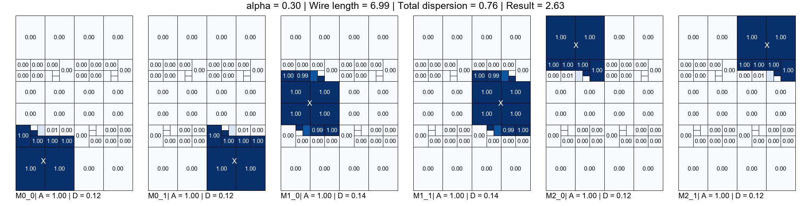
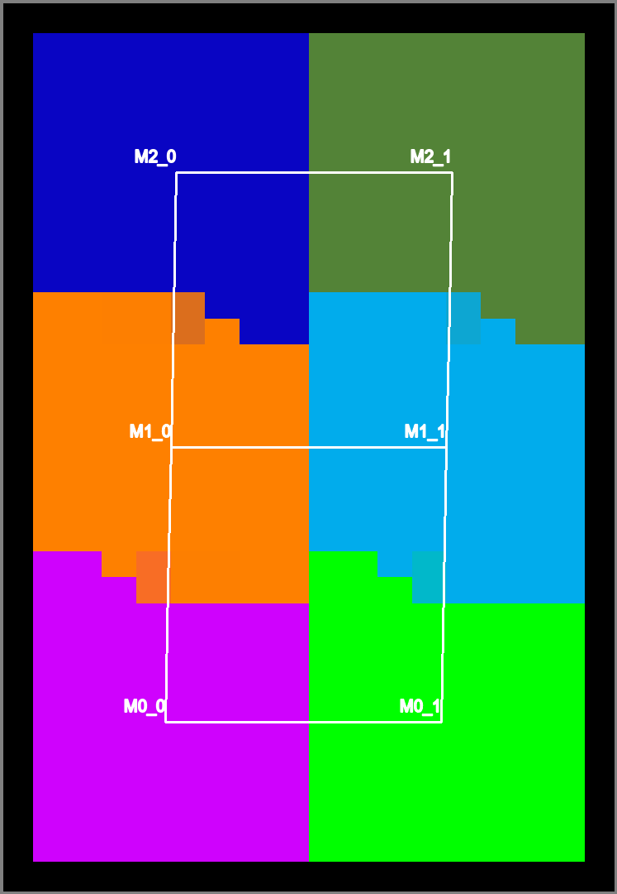
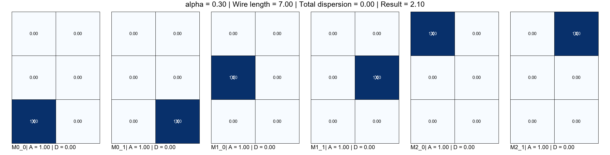

# `glbfloor` example 

```
frame netgen --type grid --size 3 2 -o initial.yml --die 2x3 --add-centers
frame draw --die 2x3 initial.yml
```


---

```
frame glbfloor -d 2x3 -g 4x4 -a 0.3 -i 10 --out-netlist 4x4-0.3-netlist.yml --out-allocation 4x4-0.3-alloc.yml -p 4x4-0.3 --verbose initial.yml  
```








```
frame draw --die 2x3 --alloc 4x4-0.3-alloc.yml 4x4-0.3-netlist.yml -o 4x4-0.3-final.gif
```



---

```
frame glbfloor -d 2x3 -g 3x2 -a 0.3 -i 10 --out-netlist 3x2-0.3-netlist.yml --out-allocation 3x2-0.3-alloc.yml -p 3x2-0.3 --verbose initial.yml
```




```
frame draw --die 2x3 --alloc 3x2-0.3-alloc.yml 3x2-0.3-netlist.yml -o 3x2-0.3-final.gif
```


