# `glbfloor` examples

Note that executing `glbfloor` with `--visualize` like it is done here takes a long time to execute
(several minutes)!

## Example 1

```
frame netgen --type grid --size 3 2 -o initial-netlist.yml --die 2x3 --add-centers
frame draw --die 2x3 initial-netlist.yml -o initial.gif
```

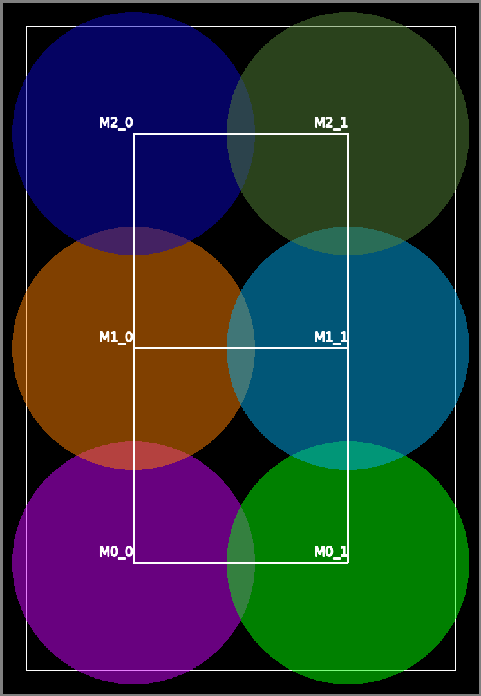

## Example 1.1

```
frame glbfloor --netlist initial-netlist.yml --die 2x3 -r 2 -n 16 -a 0.3 -i 10 --out-netlist 4x4-netlist.yml --out-allocation 4x4-alloc.yml --verbose --plot-name 4x4-plot --joint-plot --separated-plot --visualize
```

We could also have specified `-g 4x4` instead of `-r 2 -n 16`.

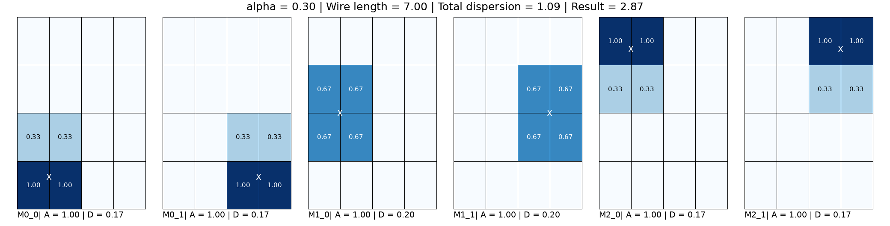
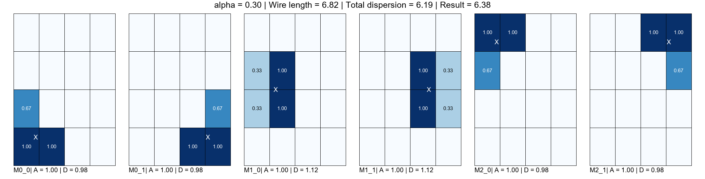
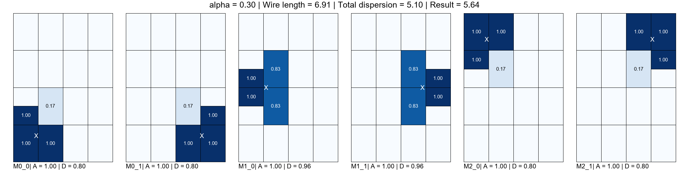
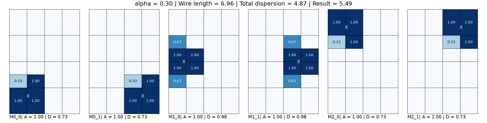
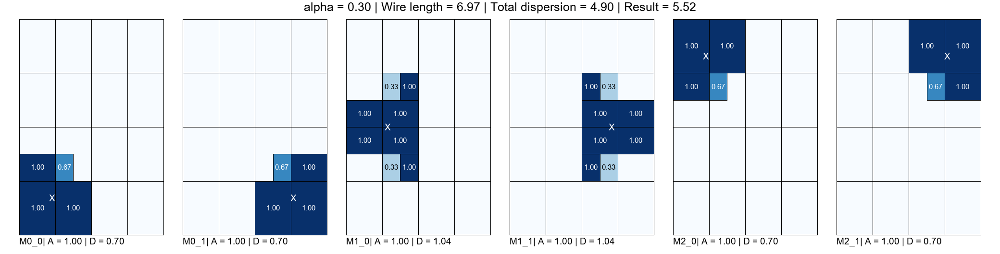
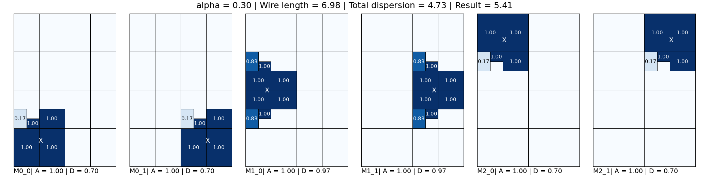
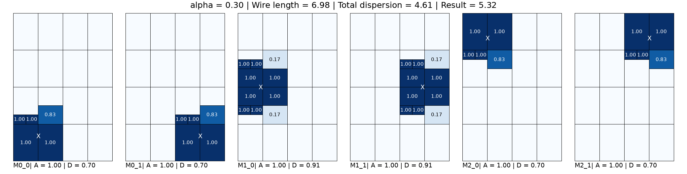

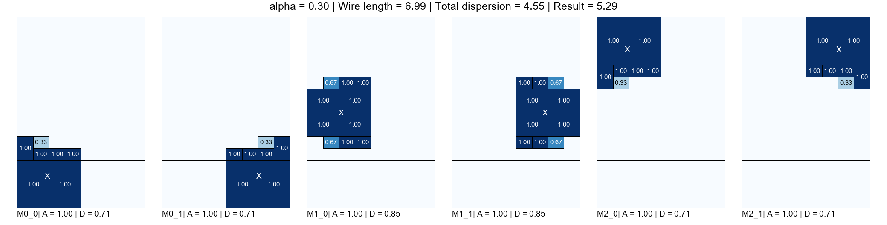
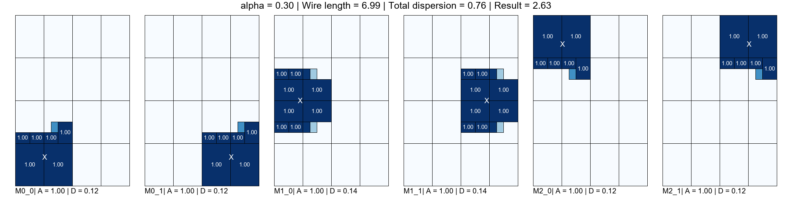
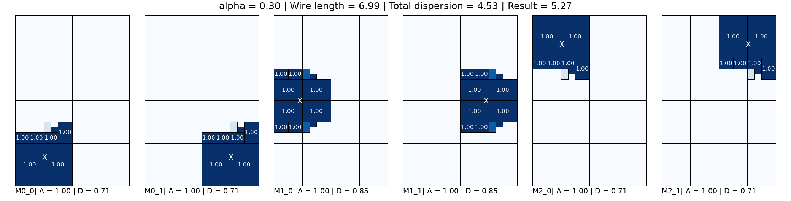


The optimal solution (six square modules) is not found due to the initial grid form.

Full optimization animation:

|              Module-by-module               |                  Joint                  |
|:-------------------------------------------:|:---------------------------------------:|
| 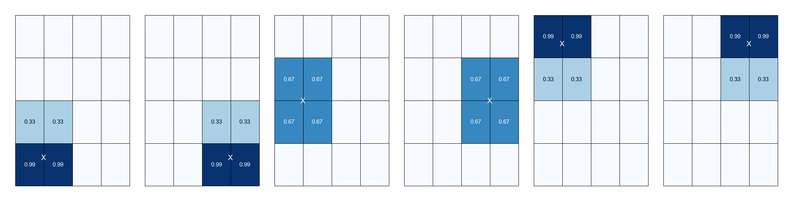 | 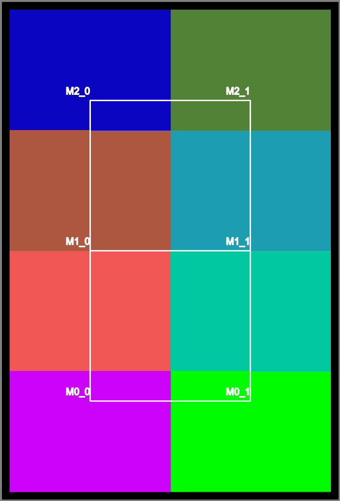 |


## Example 1.2

Same as above, but with a 3x2 initial grid:

```
frame glbfloor --netlist initial-netlist.yml --die 2x3 -g 3x2 -a 0.3 -i 10 --out-netlist 3x2-netlist.yml --out-allocation 3x2-alloc.yml --verbose --plot-name 3x2-plot --joint-plot --separated-plot --visualize
```


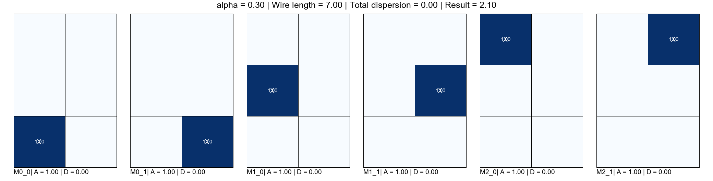

Now the optimal solution is found, and in just one optimization.

Full optimization animation:

|              Module-by-module               |                  Joint                  |
|:-------------------------------------------:|:---------------------------------------:|
| 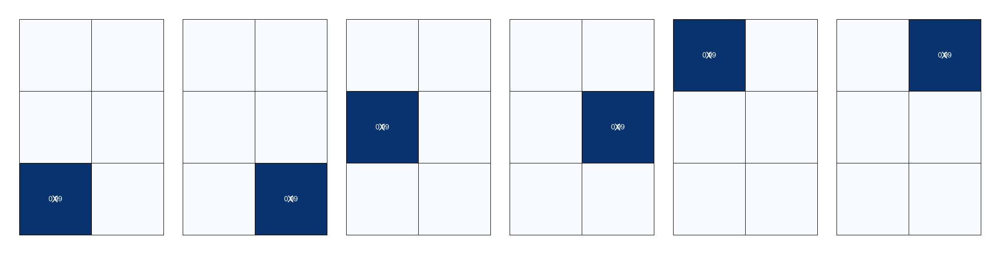 | 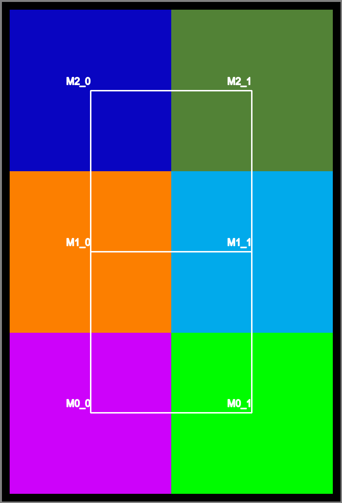 |


## Example 2

This example includes a die blockage and a fixed block.

```
frame draw --die die.yml initial-netlist.yml -o initial.gif
```

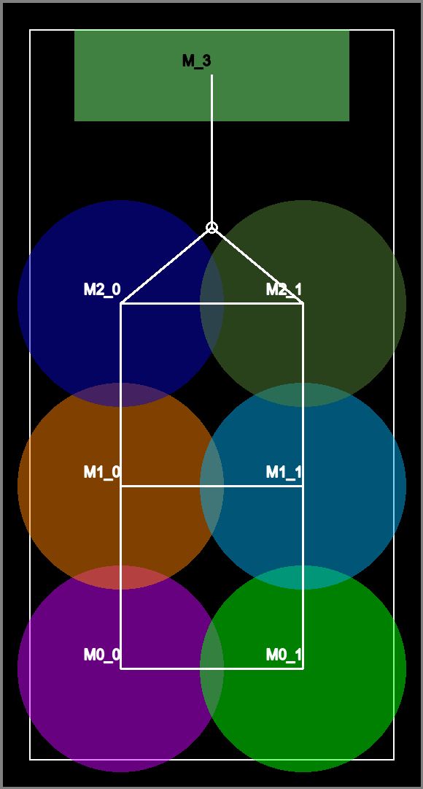

```
frame glbfloor --netlist initial-netlist.yml --die die.yml -r 2 -n 16 -a 0.3 -i 10 --out-netlist final-netlist.yml --out-allocation final-alloc.yml --verbose --separated-plot --joint-plot --visualize
```

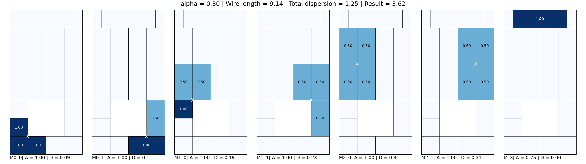


After one optimization, the floorplan cannot be further refined so no more optimizations are needed.

Full optimization animation:

|            Module-by-module             |                Joint                |
|:---------------------------------------:|:-----------------------------------:|
| 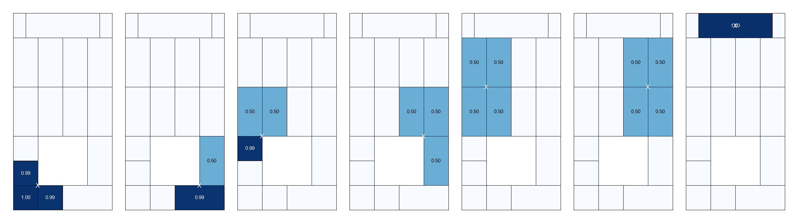 | 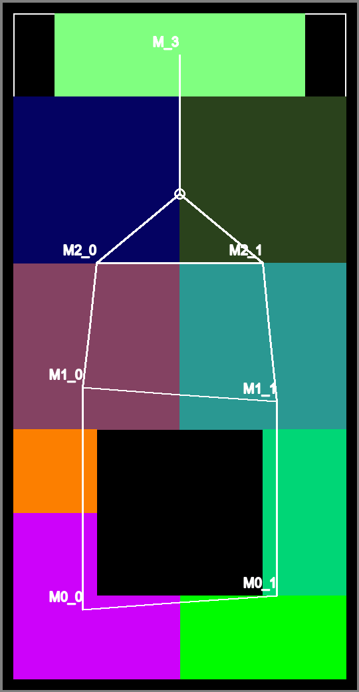 |
