# `glbfloor` examples

Note that executing `glbfloor` with `--visualize` like it is done here takes a long time to execute
(several minutes)!

## Example 1

```
frame netgen --type grid --size 3 2 -o initial-netlist.yml --die 2x3 --add-centers
frame draw --die 2x3 initial-netlist.yml -o initial.gif
```


```
frame glbfloor --netlist initial-netlist.yml --die 2x3 -r 2 -n 16 -a 0.3 -i 10 --out-netlist final-netlist.yml --out-allocation final-alloc.yml -p plot --verbose --visualize
```

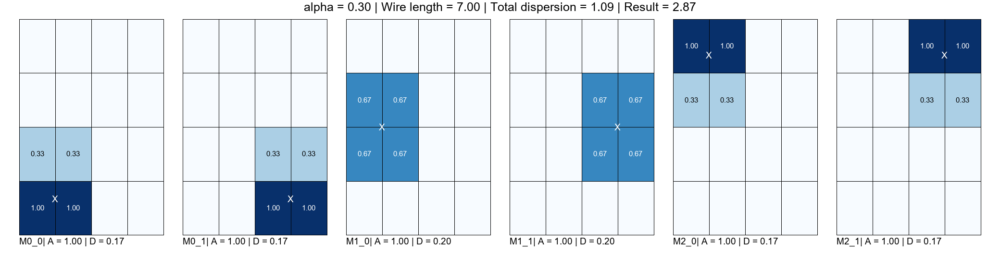

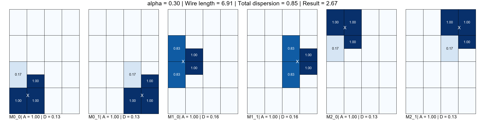
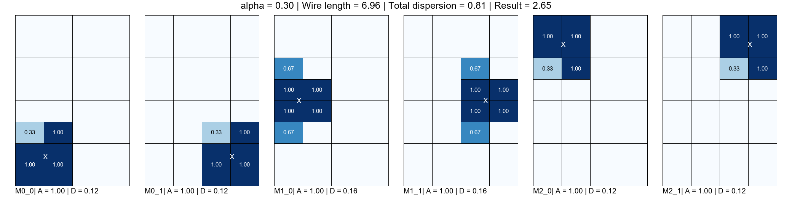
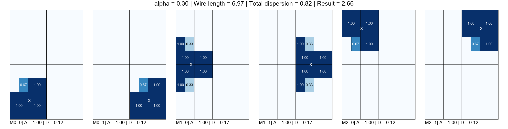


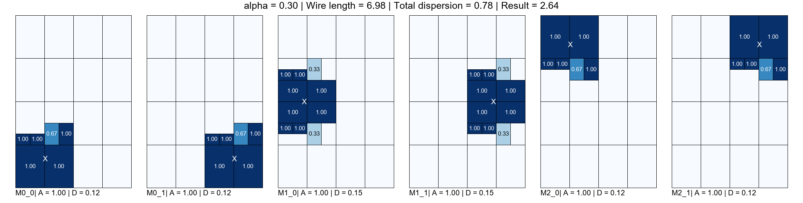
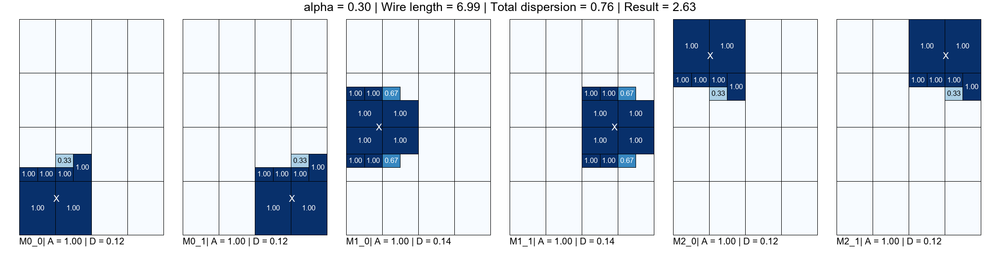
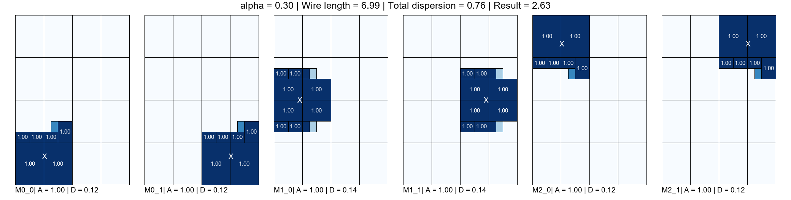
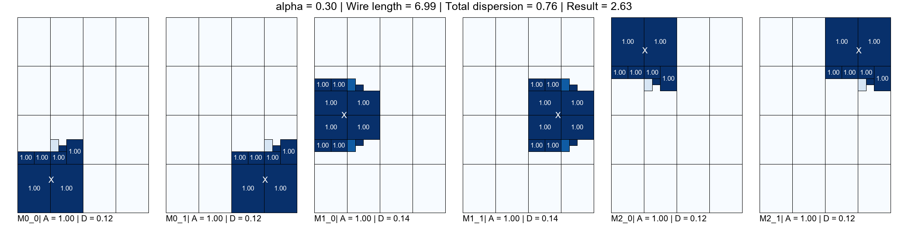

The optimal solution (six square modules) is not found due to the initial grid form.

Full optimization animation:


```
frame draw --die 2x3 --alloc final-alloc.yml final-netlist.yml -o final.gif
```


---

## Example 2

This example includes a die blockage and a fixed block.

```
frame draw --die die.yml initial-netlist.yml -o initial.gif
```


```
frame glbfloor --netlist initial-netlist.yml --die die.yml -r 2 -n 16 -a 0.3 -i 10 --out-netlist final-netlist.yml --out-allocation final-alloc.yml -p plot --verbose --visualize
```


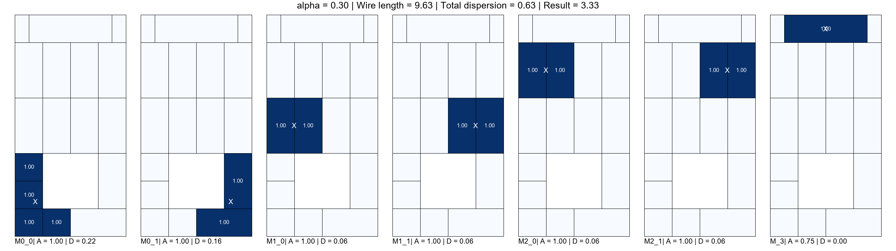

After 1 iteration, the floorplan cannot be further refined so no more optimizations are needed.

Full optimization animation:

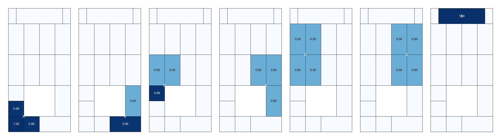

```
frame draw --die die.yml --alloc final-alloc.yml final-netlist.yml -o final.gif
```

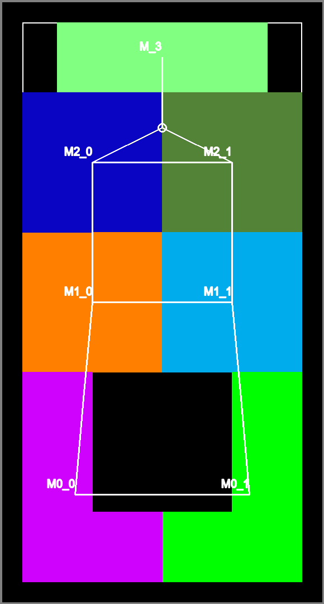
