# `glbfloor` example 

```
frame netgen --type grid --size 2 3 -o 1.yml
frame spectral --die 2x3 -o 2.yml 1.yml
frame draw --die 2x3 2.yml
```


---

```
frame glbfloor -d 2x3 -g 4x4 -a 0.3 -i 6 --out-netlist 3-4x4-0.3-netlist.yml --out-allocation 3-4x4-0.3-alloc.yml -p 3-4x4-0.3 2.yml
```

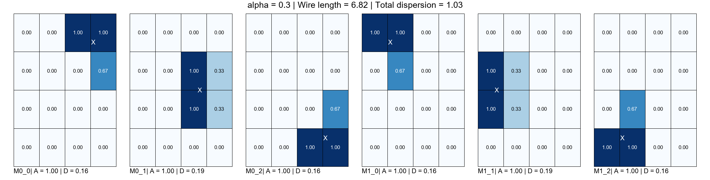
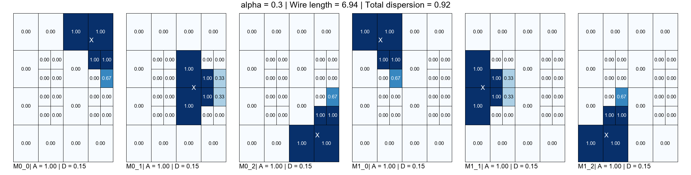
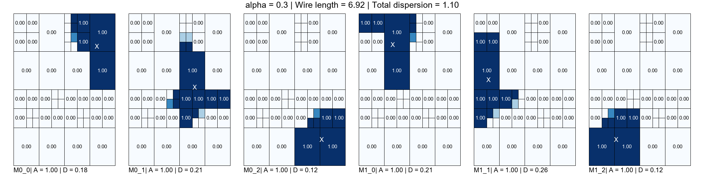
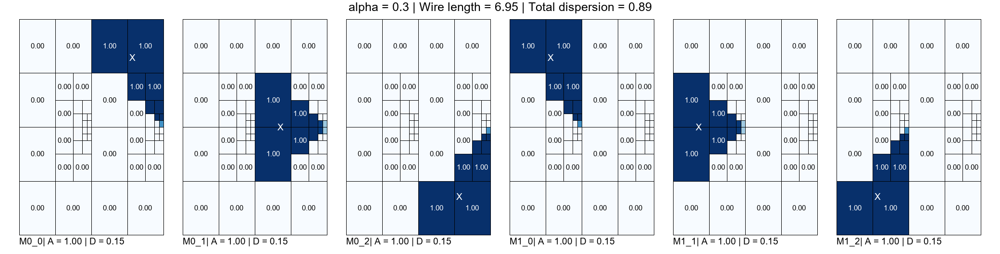
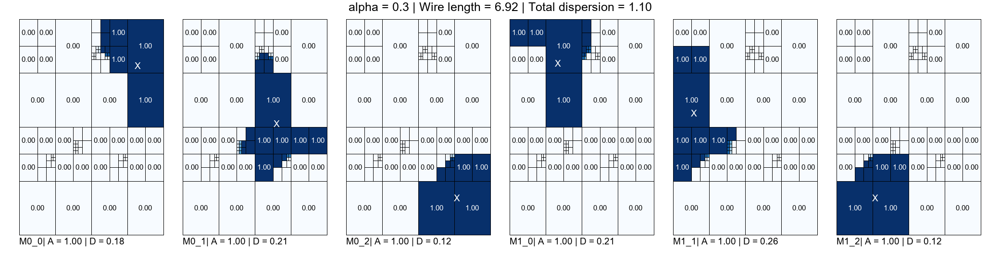


Simple plot (no annotation nor borders):

```
frame glbfloor -d 2x3 -g 4x4 -a 0.3 -i 6 --out-netlist 3-4x4-0.3-netlist.yml --out-allocation 3-4x4-0.3-alloc.yml -p 3-4x4-0.3-simple --simple-plot 2.yml
```

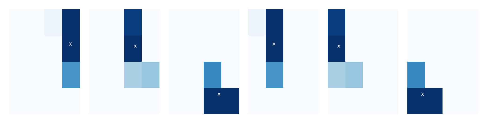
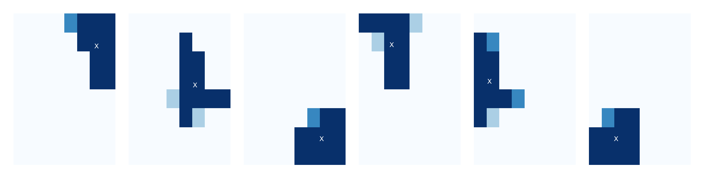
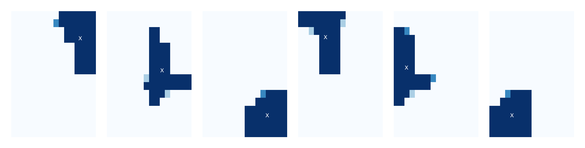
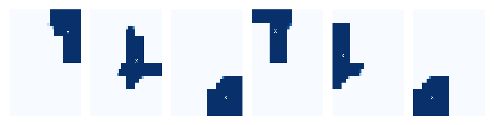

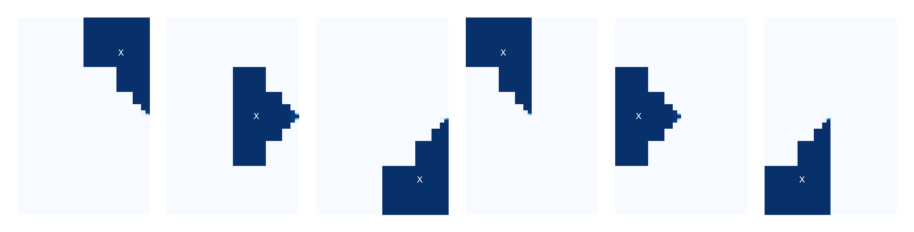

```
frame draw --die 2x3 --alloc 3-4x4-0.3-alloc.yml 3-4x4-0.3-netlist.yml -o 3.gif
```

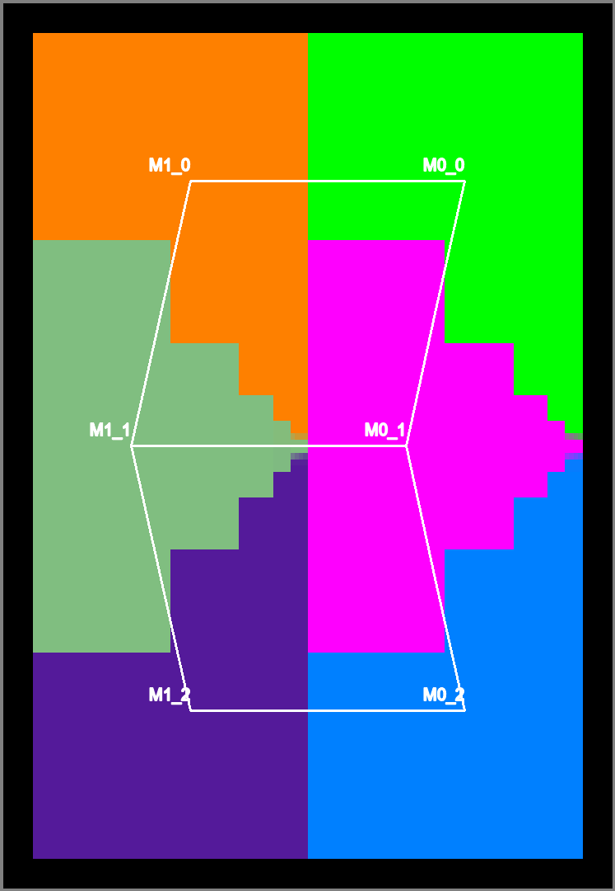

---

The folllowing results are not refined and serve to show how the initial grid and the value of alpha affect the initial allocation.

```
frame glbfloor -d 2x3 -g 4x4 -a 0.5 -p 3-4x4-0.5 2.yml
```

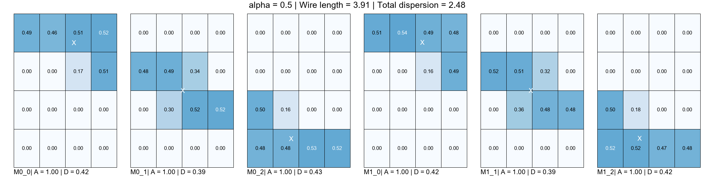


```
frame glbfloor -d 2x3 -g 8x8 -a 0.3 -p 3-8x8-0.3 2.yml
```

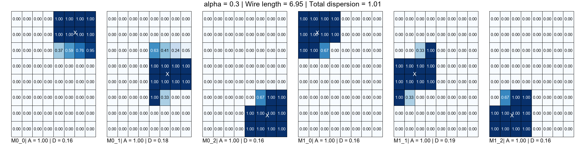

```
frame glbfloor -d 2x3 -g 8x8 -a 0.5 -p 3-8x8-0.5 2.yml
```

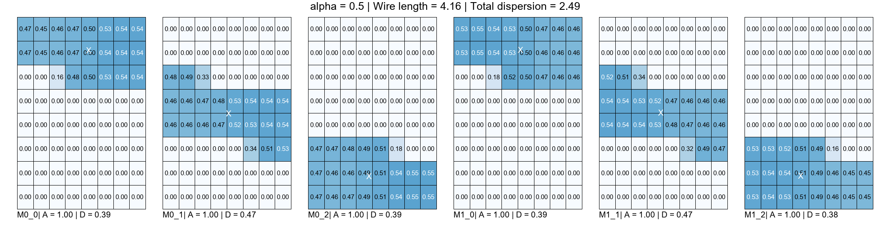
