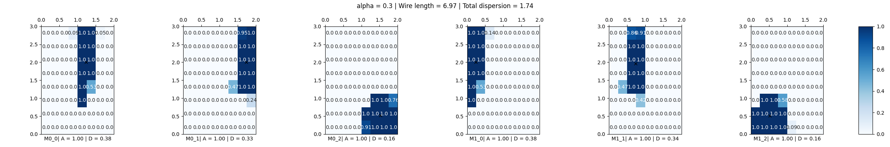
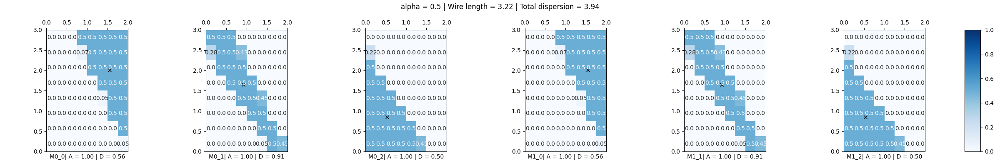

# `glbfloor` initial example 

```
frame netgen --type grid --size 2 3 -o 1.yml
frame spectral --die 2x3 -o 2.yml 1.yml
frame draw 2.yml --die 2x3
```


```
frame glbfloor -d 2x3 -g 8x8 -a 0.3 -o 3.yml 2.yml
```



```
frame glbfloor -d 2x3 -g 8x8 -a 0.5 -o 3.yml 2.yml
```


