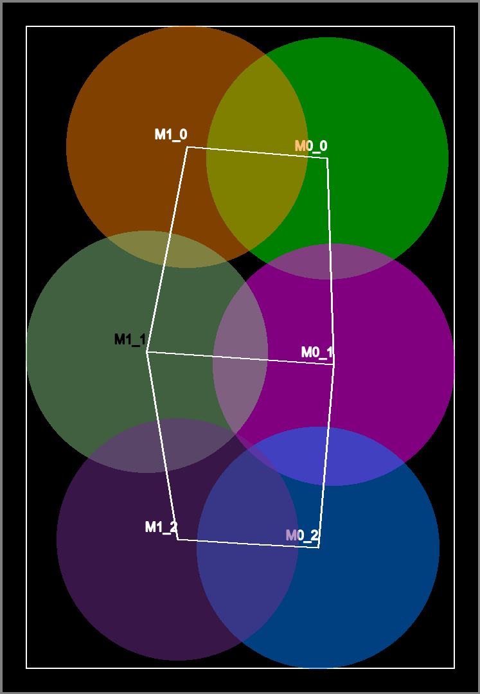
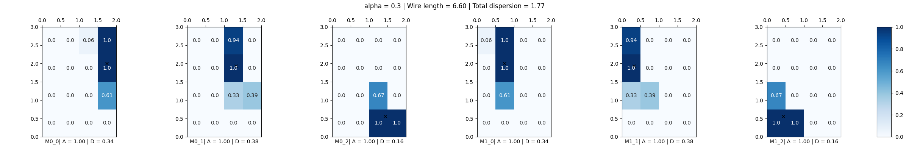
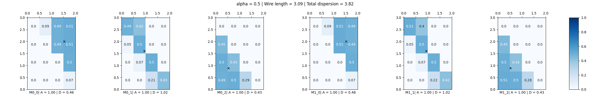

# `glbfloor` initial example 

```
frame netgen --type grid --size 2 3 -o 1.yml
frame spectral --die 2x3 -o 2.yml 1.yml
frame draw 2.yml --die 2x3
```



```
frame glbfloor -d 2x3 -g 4x4 -a 0.3 --out-netlist 3-4x4-0.3-netlist.yml --out-allocation 3-4x4-0.3-alloc.yml -p 3-4x4-0.3.png 2.yml
```




```
frame glbfloor -d 2x3 -g 4x4 -a 0.5 -p 3-4x4-0.5.png 2.yml
```




```
frame glbfloor -d 2x3 -g 8x8 -a 0.3 -p 3-8x8-0.3.png 2.yml
```


```
frame glbfloor -d 2x3 -g 8x8 -a 0.5 -p 3-8x8-0.5.png 2.yml
```


