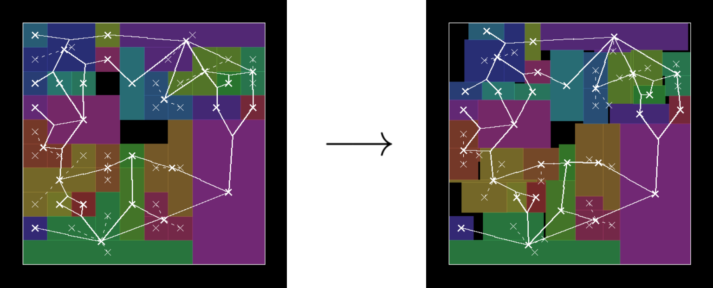

# Legalfloor: Floorplan Legalization Tool

## Problem Statement

Given a (non-necessarily legal) floorplan, legalize the floorplan (aka, make no two rectangles overlap) and minimize the 
wirelength of the connections hypergraph as much as possible.



## Usage

```
Usage: legalfloor.py [options]

A tool for module legalization

positional arguments:
  netlist               Input netlist (.yaml)
  die                   Input die (.yaml)

options:
  -h, --help            show this help message and exit
  --max_ratio MAX_RATIO The maximum allowable ratio for a rectangle
  --plot                Plots the problem together with the solutions found
  --verbose             Shows additional debug information```
```

## Objective function
Let $M$ be the set of modules, and for every $m \in M$, let $(x_{m}, y_{m})$ be the center of mass of the module.

Also, let $\Omega$ be the hypergraph connecting the modules, and let $\langle \omega, S \rangle \in \Omega$ be a 
hyperedge, where $\omega \in \mathbb{R}^{\geq 0}$ is the weight of the edge and $S \subseteq M$ is a multiset of $M$.

For every multisubset $S$ of $M$, we define the center as:

$x(S) = \frac{1}{|S|} \sum_{m \in S} x_m$

$y(S) = \frac{1}{|S|} \sum_{m \in S} y_m$

The objective function is the following:

Minimize $\sum_{\langle \omega, S \rangle \in \Omega} \sum_{m \in S} 4\omega^2 \cdot ( (x_{m} - x(S))^2 + (y_{m} - y(S))^2 )$