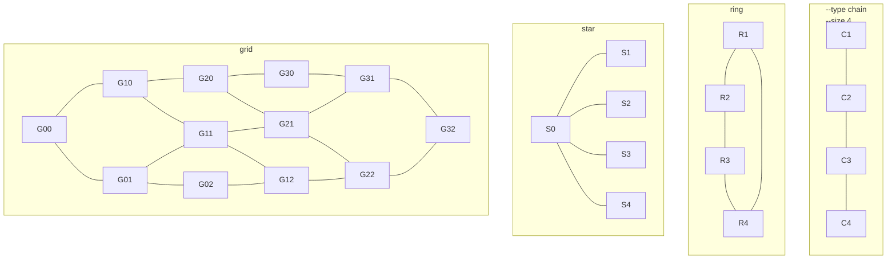

# Netlist generation

This is a tool to generate some netlists. The usage is

```
usage: frame netgen [options]

A netlist generator

options:
  -h, --help            show this help message and exit
  -o OUTFILE, --outfile OUTFILE
                        output file (netlist)
  --type {grid,chain,ring,star}
                        type of netlist (grid, chain, ring, star)
  --size SIZE [SIZE ...]
                        size of the netlist
```
The figure below depicts the netlists generated when selecting one the acceptable types.
The option `size` can be followed by one or two positive integers, indicating the number of
modules in the netlist. When selecting a grid, the number of rows and columns are specified,
e.g., `--size 4 3` for four rows and three columns.


