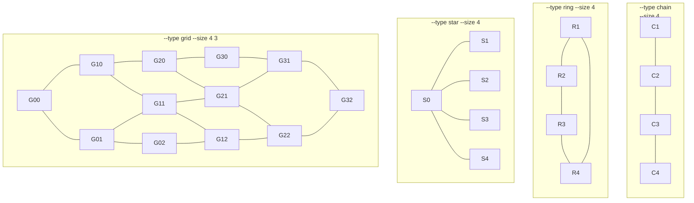

# Netlist generation

This is a tool to generate some netlists. The usage is

```
usage: frame netgen [options]

A netlist generator.

options:
  -h, --help            show this help message and exit
  -o OUTFILE, --outfile OUTFILE
                        output file (netlist)
  --type {grid,chain,ring,star,ring-star,one-net,htree}
                        type of netlist (grid, chain, ring, star, ring-star, one-net, htree)
  --size SIZE [SIZE ...]
                        size of the netlist
  --add-centers         add module centers (only supported for grid type, and requires to specify the die)
  --add-noise [STANDARD DEVIATION]
                        (used only if --add-centers is present) adds random gaussian noise to the centers
  --seed SEED           (used only if --add-noise is present) integer number used as a seed for the random number generator
  -d <width>x<height> or filename, --die <width>x<height> or filename
                        (used only if --add-centers is present) size of the die (width x height) or name of the file
```
The figure below depicts the netlists generated when selecting one the acceptable types.
The option `size` can be followed by one or two positive integers, indicating the number of
modules in the netlist. When selecting a grid, the number of rows and columns are specified,
e.g., `--size 4 3` for four rows and three columns.


